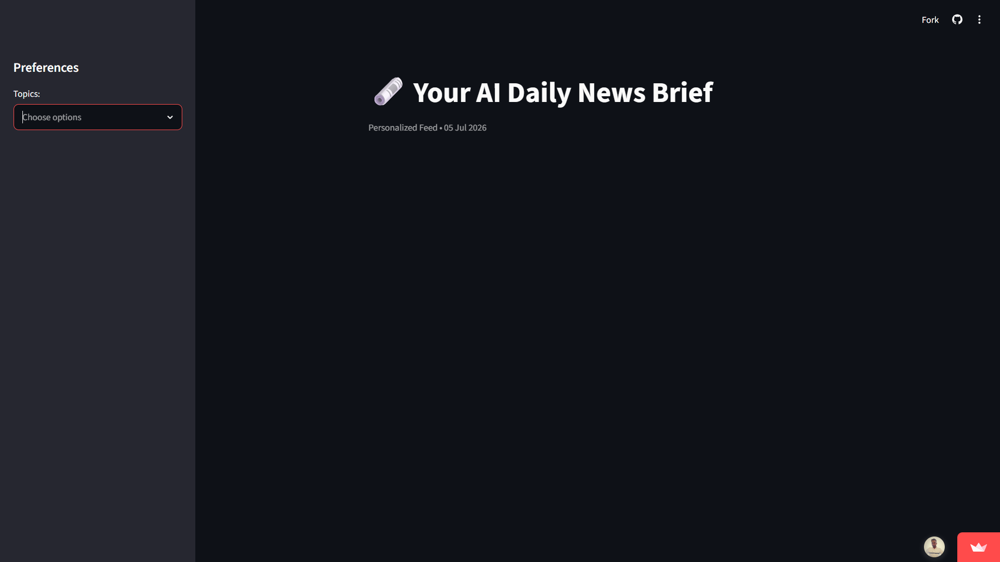
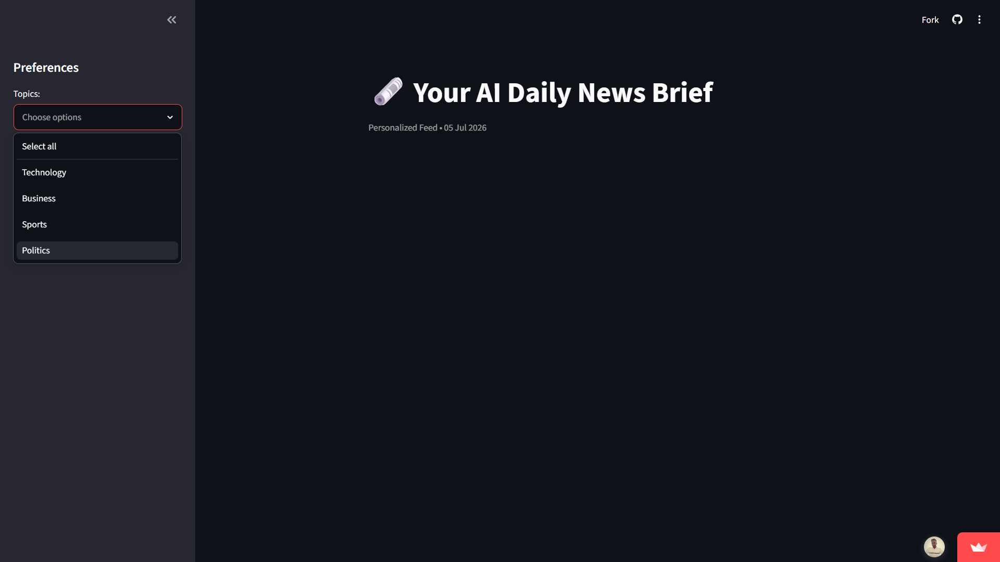
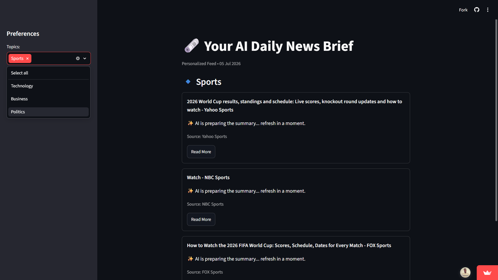

# 🗞️ AI-Powered Daily News Brief Generator

A personalized news briefing system that aggregates headlines from multiple global sources and uses AI to provide concise, readable summaries.

## 🚀 Deployed Application
[👉 Click here to view the Live App](https://rajarajan71-daily-news-brief-generator-app-btq2ji.streamlit.app/)

## 📸 Application Demo

### 🏠 Home Page

The landing page where users can browse the latest AI-powered news summaries and select their preferred news categories.

---

### 💬 News Query & Category Selection

Users choose their preferred news categories or topics to generate personalized AI-powered news briefs.

---

### 🤖 AI News Summary Generation

The application retrieves the latest headlines and generates concise, AI-powered summaries using transformer-based NLP models.

---

### 📰 Final Personalized News Brief

Displays the complete AI-generated news briefing with summaries and links to the original news sources.

---

## 🛠️ Tech Stack
- **Frontend:** Streamlit (Hosted on Community Cloud)
- **News Source:** GNews (Aggregating from BBC, Reuters, The Verge, etc.)
- **AI Engine:** Hugging Face Inference API (BART Transformer Model)
- **Backend:** Python 3.x

## 🧠 Core Features & Documentation

### 1. Preference Handling Logic
The application uses a **Sidebar Preference Manager**. User selections (e.g., Technology, Business) are captured via a multiselect widget. These preferences are used to dynamically filter news queries, ensuring the home page displays only relevant content by default as per the project requirements.

### 2. News Aggregation Approach
We utilize a **Multi-Source Aggregation** strategy. Instead of a single RSS feed, the system queries the GNews library to pull the top 3 high-authority articles per segment from the last 24 hours. This ensures a diverse range of perspectives and real-time reliability.

### 3. AI Summarization & Neutrality
To provide concise insights, the app employs an **Abstractive Summarization** model (`bart-large-cnn`). 
- **Wait-for-Model Logic:** Implemented to handle free-tier API cold starts.
- **Neutrality:** The model is tasked with factual compression, focusing on core reporting to maintain unbiased delivery.

## 🏃 Sample User Flow
1. **Landing:** User opens the app and sees a default brief for their pre-set categories.
2. **Personalize:** User opens the sidebar to add or remove news segments (e.g., adding "Politics").
3. **Generate:** The app fetches the latest news for the new segment and generates AI summaries on the fly.
4. **Deep Dive:** User reads the concise AI summary and can click "Read More" to visit the original source.

## 📦 Installation
To run locally:
1. `pip install -r requirements.txt`
2. `streamlit run app.py`
*(Note: Requires a Hugging Face API Token in secrets)*
